# 🎂 BirthdayVisualiser

**Explore your contacts' birthdays through interactive timelines, statistics, and insights.**

🔗 **[Live Demo →](https://nottoxel.github.io/BirthdayVisualiser/)**

---

## ✨ Features

- **🗓 Interactive Timeline** — Zoomable vis.js timeline showing every contact's birthday, with hover cards and click-to-detail.
  
  | View | Light Mode | Dark Mode |
  | :--- | :---: | :---: |
  | **Desktop** | 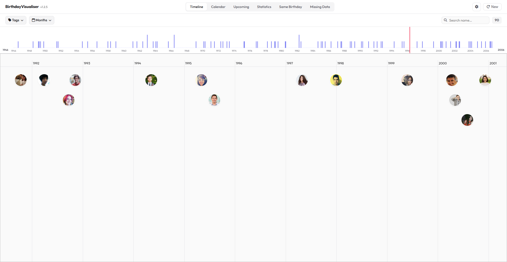 | 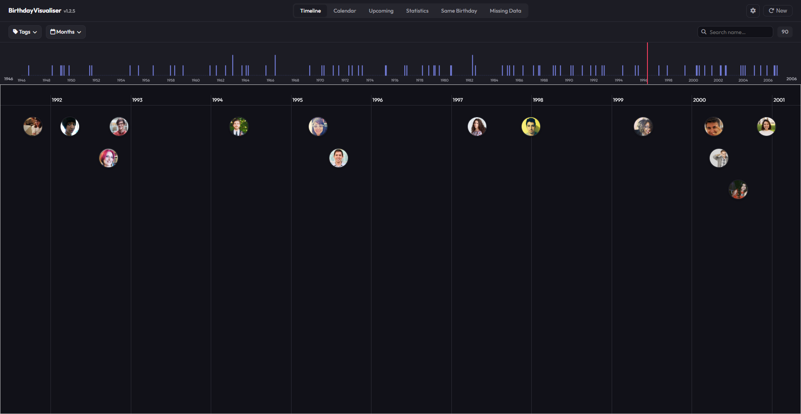 |
  | **Mobile** | 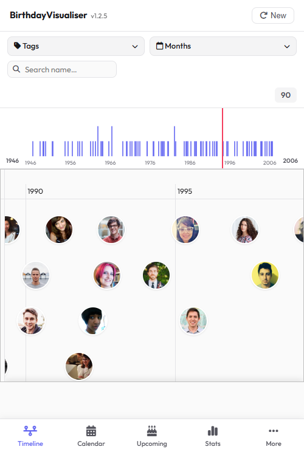 | 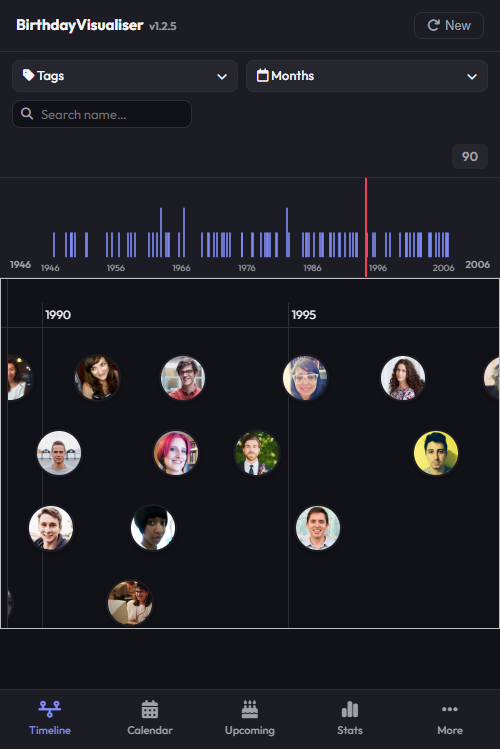 |

- **📅 Calendar View** — Monthly calendar with birthday density, contact photos, mouse wheel navigation, and a date selector with heatmap preview.
  
  | View | Light Mode | Dark Mode |
  | :--- | :---: | :---: |
  | **Desktop** | 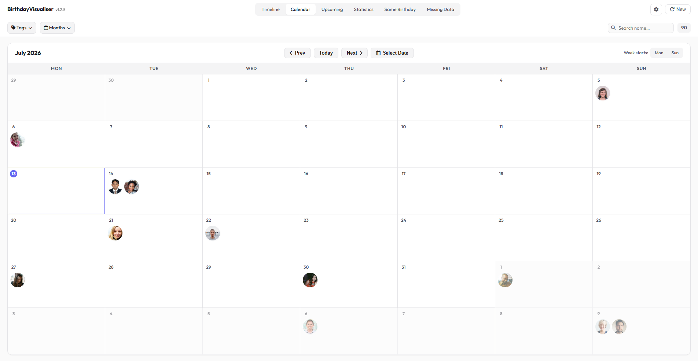 | 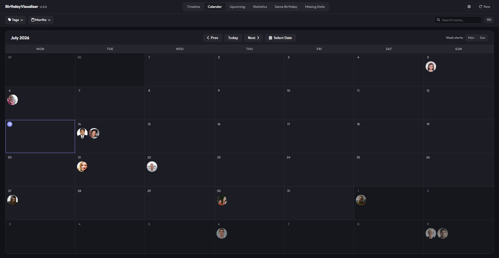 |
  | **Mobile** | 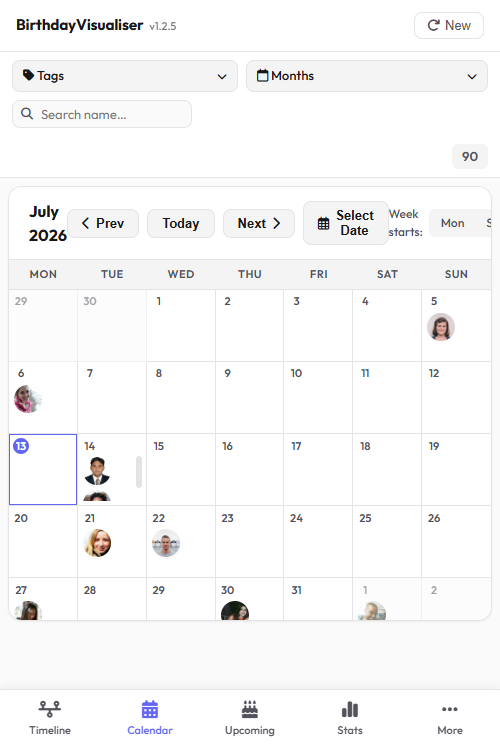 | 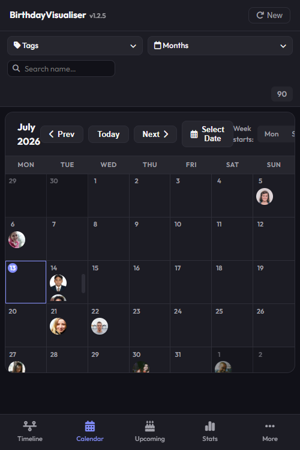 |

- **📊 Rich Statistics & ☁️ Contact Cloud** — Comprehensive charts for birth months, decades, years, weekdays, etc. and animated hexagonal honeycomb bubble visualization.
  
  | Statistics Dashboard | Contact Cloud |
  | :---: | :---: |
  | 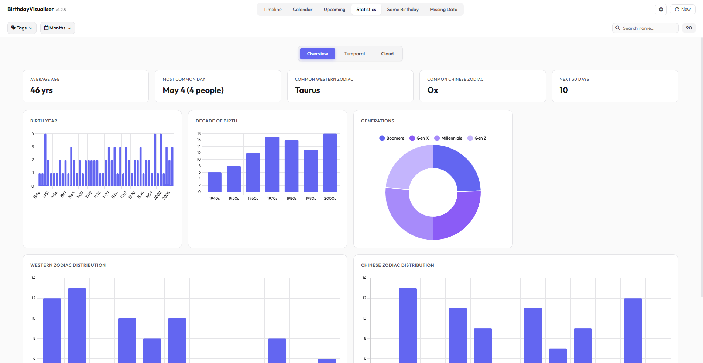 | 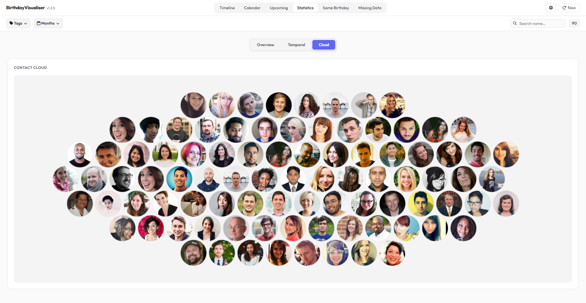 |

- **🔍 Smart Filters** — Filter by tags, months, and name search in real-time across all views.
  
  | Active Name Search Filter | Tags Filter Dropdown |
  | :---: | :---: |
  | 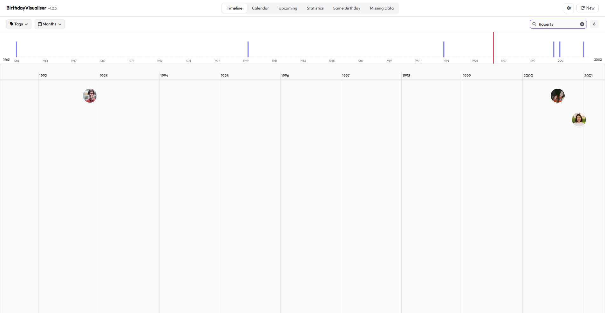 | 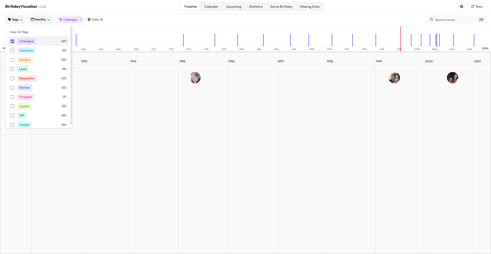 |

- **⏰ Upcoming Birthdays & 👥 Same Birthday** — Countdown list with color-scaled urgency indicators and busiest week KPI, plus a view to discover contacts sharing the same birthday.
  
  | Upcoming Birthdays | Same Birthday |
  | :---: | :---: |
  | 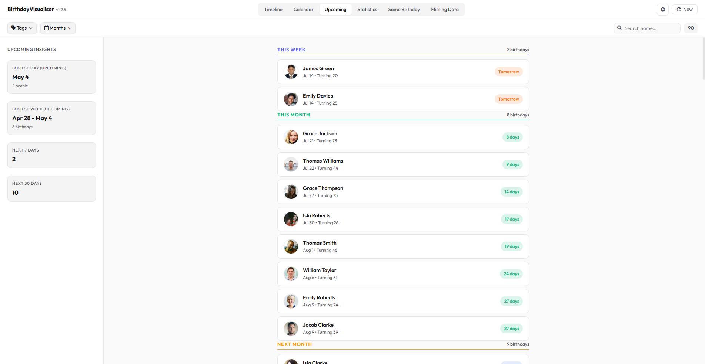 | 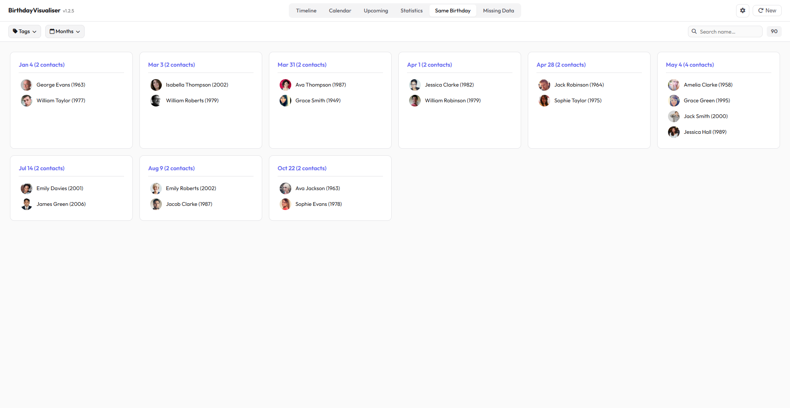 |

- **📋 Missing Data Audit** — Identify contacts missing birthday information to keep your contact list clean.
  
  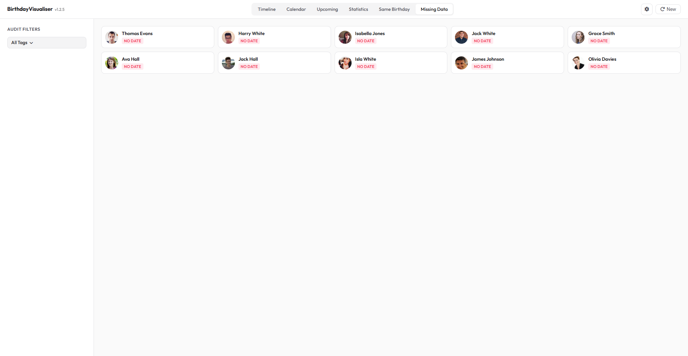

- **🌙 Dark Mode** — Full dark/light theme toggle.
- **📱 Mobile Responsive** — Optimized layouts with bottom navigation for mobile devices.
- **🔒 100% Private** — All data processing happens entirely in your browser. No data is ever uploaded or stored on any server.

---

## 🚀 Getting Started

### Option 1: Try the Demo
Visit the [live demo](https://nottoxel.github.io/BirthdayVisualiser/) and click **"Try Demo"** to explore with sample data.

| View | Light Mode | Dark Mode |
| :--- | :---: | :---: |
| **Desktop** | 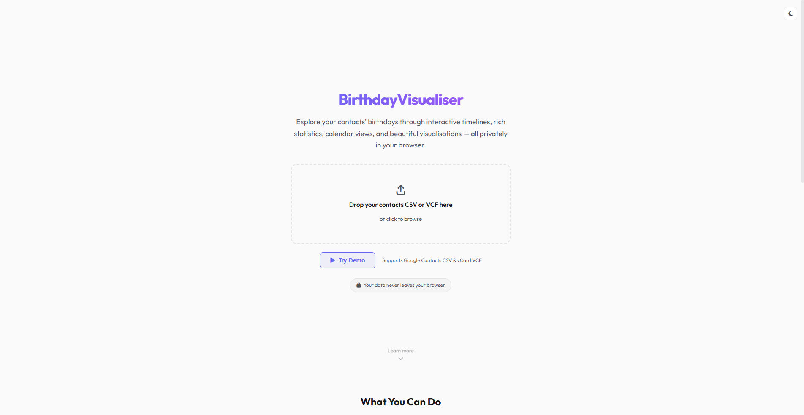 | 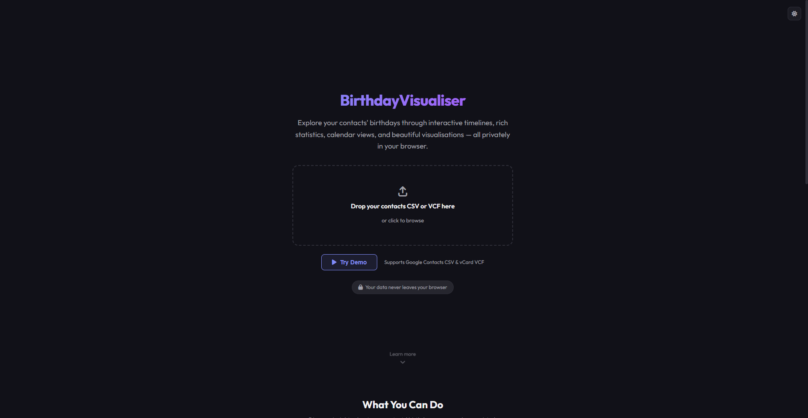 |
| **Mobile** | 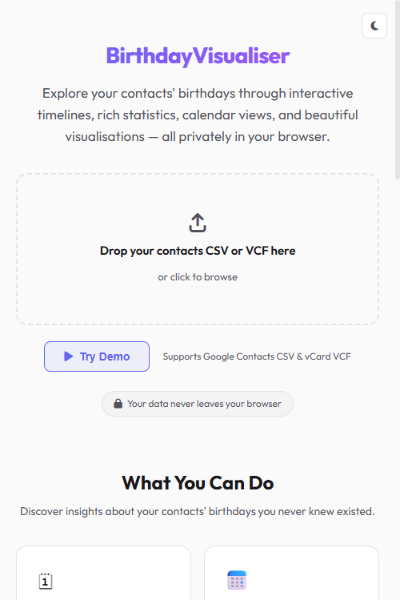 | 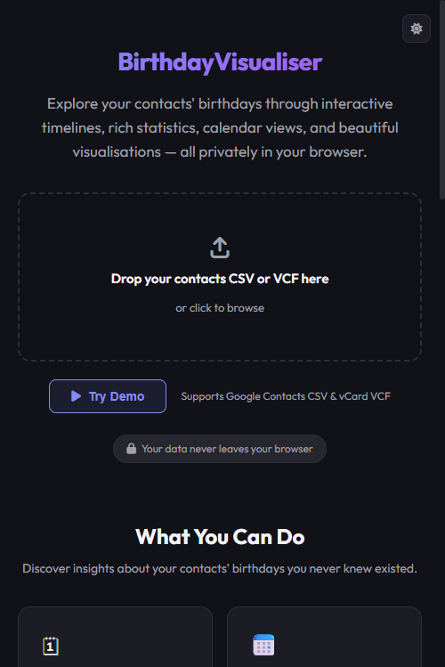 |

### Option 2: Use Your Own Contacts
1. Export your contacts as a **CSV** or **VCF (vCard)** file (see [Export Guides](#-how-to-export-your-contacts) below)
2. Visit [BirthdayVisualiser](https://nottoxel.github.io/BirthdayVisualiser/)
3. Drag and drop your file onto the upload area, or click to browse
4. Explore your birthday data across all the available views

---

## 📁 Supported File Formats

| Format | Extension | Description |
|--------|-----------|-------------|
| **CSV** | `.csv` | Comma-separated values — the standard export from Google Contacts |
| **VCF** | `.vcf`, `.vcard` | vCard 3.0/4.0 — the standard export from Apple Contacts and many other apps |

### CSV Column Detection
BirthdayVisualiser automatically detects common column headers:
- **Name**: `Name`, `First Name`, `Given Name`, `Last Name`, `Family Name`
- **Birthday**: `Birthday`, `Bday`, `Birth Date`, `Date of Birth`, `DOB`
- **Tags/Groups**: `Label`, `Group`, `Category`
- **Photo**: `Photo`, `Avatar`, `Picture`
- **Email/Phone**: Standard email and phone column variants

---

## 📤 How to Export Your Contacts

### Google Contacts (Desktop)
1. Go to [contacts.google.com](https://contacts.google.com)
2. Click **"Export"** in the left sidebar (or select specific contacts first)
3. Choose **"Google CSV"** format
4. Click **"Export"** to download

📖 [Official Google Support Article →](https://support.google.com/contacts/answer/7199294)

### Apple Contacts (Mac)
1. Open the **Contacts** app
2. Select the contacts you want to export (or select all with `⌘A`)
3. Go to **File → Export → Export vCard...**
4. Save the `.vcf` file

📖 [Official Apple Support Article →](https://support.apple.com/en-gb/guide/contacts/adrbk1457/mac)

### Apple Contacts (iPhone/iPad)
Export all contacts directly on your device as a single vCard (VCF) file:
1. Open the **Contacts** app
2. Tap **"Lists"** in the top-left corner
3. Touch and hold **"All Contacts"** (or a specific group list)
4. Tap **"Export"** in the menu
5. Select **"Save to Files"** to save the `.vcf` file locally (or share via email, AirDrop, etc.)

📖 [Official Apple Support Article →](https://support.apple.com/en-gb/guide/iphone/iph075ddebf2/ios)

### Outlook
1. Go to [outlook.live.com/people](https://outlook.live.com/people/)
2. Click **"Manage contacts"** → **"Export contacts"**
3. Choose CSV format and download

### Other Providers
Most contact management apps support exporting as CSV or vCard (VCF). Check your provider's help documentation for specific instructions.

---

## 🎮 Demo Mode

Click the **"Try Demo"** button on the landing page to load [demo-contacts.csv](demo-contacts.csv) — a sample dataset of fictional contacts spanning different decades, tag groups, and birth months. This lets you explore all features without uploading your own data.

---

## 🔒 Privacy

**Your data never leaves your browser.** BirthdayVisualiser processes everything client-side using JavaScript. No contact data is uploaded to any server, stored in any database, or shared with any third party. The application works entirely offline after the initial page load.

---

## 🛠 Tech Stack

- **HTML/CSS/JavaScript** — Single-file application, no build step required
- **[vis.js](https://visjs.org/)** — Interactive timeline visualisation
- **[Chart.js](https://www.chartjs.org/)** — Statistical charts and graphs
- **[PapaParse](https://www.papaparse.com/)** — CSV parsing
- **[Font Awesome](https://fontawesome.com/)** — Icons
- **[Google Fonts](https://fonts.google.com/)** — Outfit + Inter typography
- **GitHub Pages** — Static hosting

---

## 📄 License

This project is licensed under the **GNU Affero General Public License v3.0** — see the [LICENSE](LICENSE) file for details.

---

Made with ❤️ by [NotToxel](https://github.com/NotToxel)
